# Google Apps Scriptとの連携


## フォルダ作成


Googleドライブに適当なフォルダを作成しましょう。
この中身がプログラムを動かすファイル群になります。

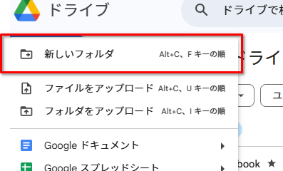

フォルダを作ったら以下の2ファイルを作成します。

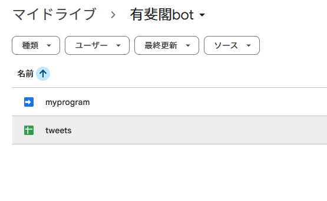

- ツイート内容を溜めておくスプレッドシート
- プログラム（Google Apps Script）

それぞれ左上の「新規」ボタンから作成できます。それぞれ名前は適当につけましょう。
後者は「その他」をクリックしたサブメニューから作成できます。

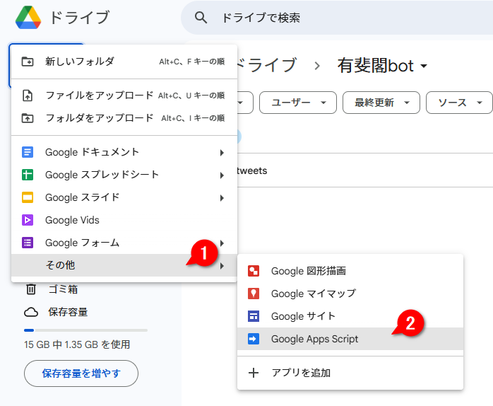


## シートの準備

作成したスプレッドシートのシート1にボットが告知内容を溜めていく仕組みです。シート1は最初は空ですが、プログラムが動き始めると下図のようになります。

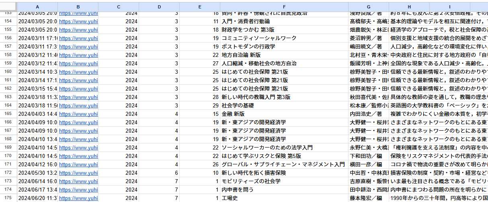

A列から順に、下記の情報が溜まっていきます。

1. タイムスタンプ
1. URL
1. 発売年
1. 発売月
1. 発売日
1. タイトル
1. 著者情報
1. 紹介文


シート2が投稿内容のテンプレートです。

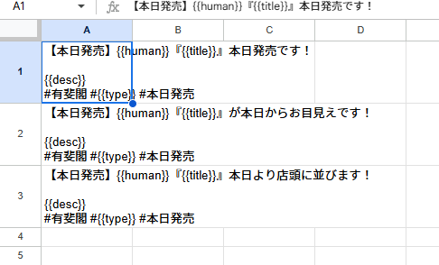


```
【本日発売】{{human}}『{{title}}』本日発売です！

{{desc}}
#有斐閣 #{{type}} #本日発売
```

といった各セルの内容に対して、 

`{{human}}` `{{title}}` `{{desc}}` にはそれぞれ上記シートの「著者」「タイトル」「説明文」が入り、 `{{type}}` には「新刊」もしくは「改訂版」の文字が入ります。

複数設定しておくと、そのなかからランダムに選択する仕組みです。
（上図では`本日発売です！` `本日からお目見えです！` `本日より店頭に並びます！` の3パターン）

ここまででシートの準備はおしまいです。

以降のプログラムでこのシートを利用するために、URLからシートIDを取得しておきます。

URLは `https://docs.google.com/spreadsheets/d/xxxxxxxxxxxxxxxxxxxxxxxxxxxx/edit?gid=nnnnnnnnnnn#gid=mmmmmmmmm` のような構造になっているはずです。


このうち、`docs.google.com/spreadsheets/d/` に続く部分（この例では `xxxxxxxxxxxxxxxxxxxxxxxxxxxx` の部分）がシートIDなので、メモ帳などにコピペしておきましょう。


## Google Apps Scriptの設定

### コードの作成

作成しておいてGoogle Apps Scriptをダブルクリックして開くと、以下のように書かれているはずなので、まずはこれをすべて削除します。

```
function myFunction() {
  
}

```

それから、[src.js](./src.js) をコピーして貼り付けます。

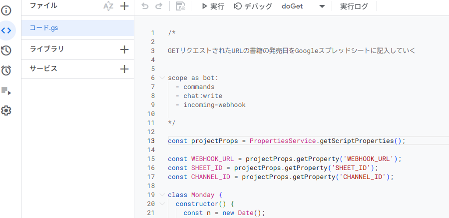

次に、コードをアプリと紐付けます。

まずは左サイドバーの歯車アイコンをクリックし、下までスクロール。

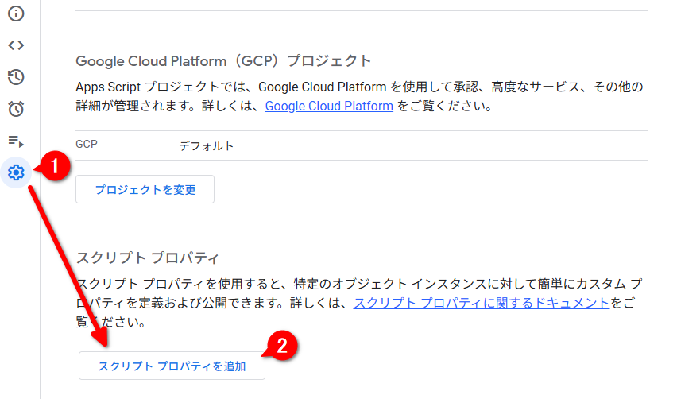


`スクリプトプロパティを追加` をクリックして以下の3項目を設定します。

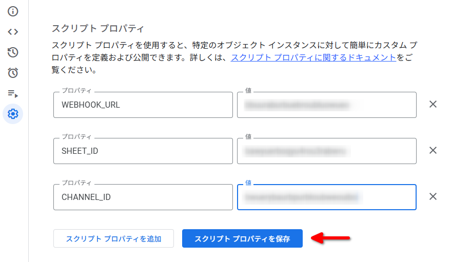

- `WEBHOOK_URL` …… 口頭で伝えます
- `SHEET_ID` …… 先ほどコピペしておいたシートID
- `CHANNEL_ID` …… Slack の下記箇所をクリックしてコピー


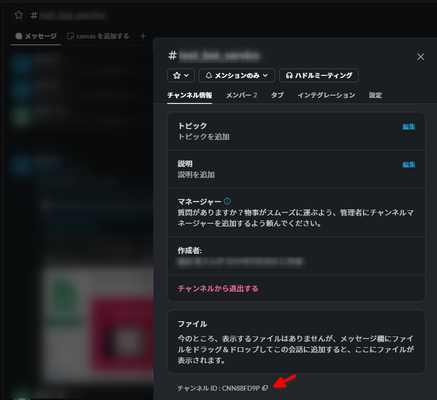


上記のスクリプトは、以下の2つの機能を持ちます。

- Chrome拡張機能から送信された書籍情報をシートに登録していく
- 指定した時刻に、シートの中から来週発売となる書籍を選んで、Slackに投稿する

前者の機能は次のセクションで設定していくとして、先に後者の「指定時刻でのスクリプト実行」を設定します。

### 指定時刻にスクリプトを実行する

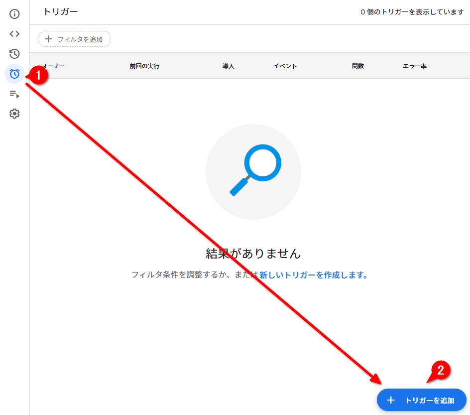

左側の目覚まし時計アイコンをクリックすると「トリガー」の設定画面に遷移します。
「トリガーを追加」ボタンを押すと、何を基準にスクリプトを実行するかを設定できます。

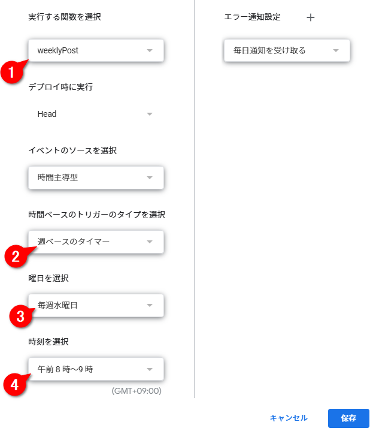

- 「実行する関数を選択」は `weeklyPost`
- 「時間ベースのトリガーのタイプ」は「週ベースのタイマー」
- 「曜日」は「毎週水曜日」
- 「時刻」は「午前8時～9時」

以上のように設定することで、「毎週水曜日の午前8時～9時に、上記コードの`weeklyPost`関数を実行して、翌々週に発売となる書籍の投稿予約をするようにSlackへ投稿する」という意味になります。


## Google Apps Scriptとchrome拡張機能の連携

### Google Apps Script側

最後に、Chrome拡張機能とGoogle Apps Scriptを連携させます。


スクリプトをプログラムとして世に送りだすことを「デプロイ」と呼びます。
右上の「デプロイ」ボタンから「新しいデプロイ」をクリックすると、手続き画面が開きます。

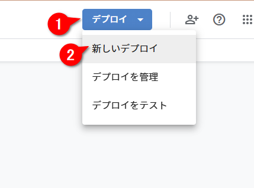

デプロイの種類は「ウェブアプリ」を選択。説明欄などは空白のママでOKですが、注意点として、「アクセスできるユーザー」を「全員」にするのを忘れないでください。
（「プログラムがアクセスする」という意味で「全員」です）

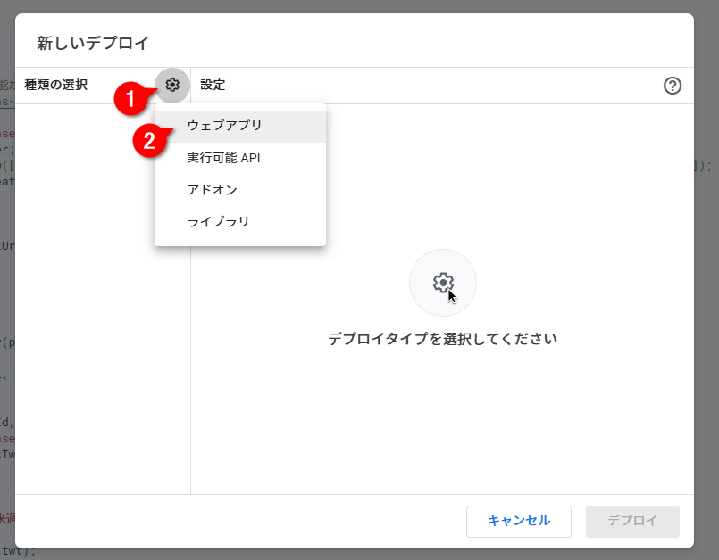

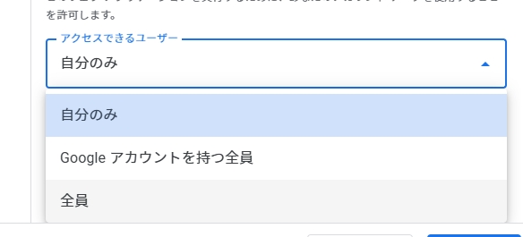

初回はアクセスの承認を求められます。
これは、スプレッドシートのデータの読み取りや、外部サービスとしてSlackにアクセスする機能を持たせたためです。

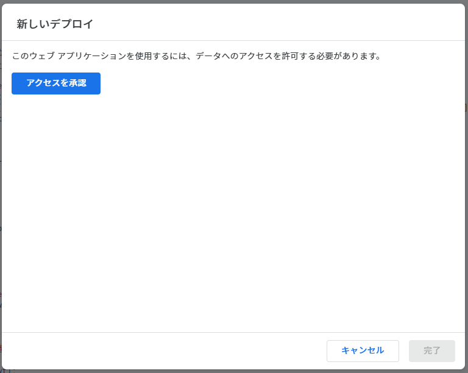

自分のアカウントで承認したら、

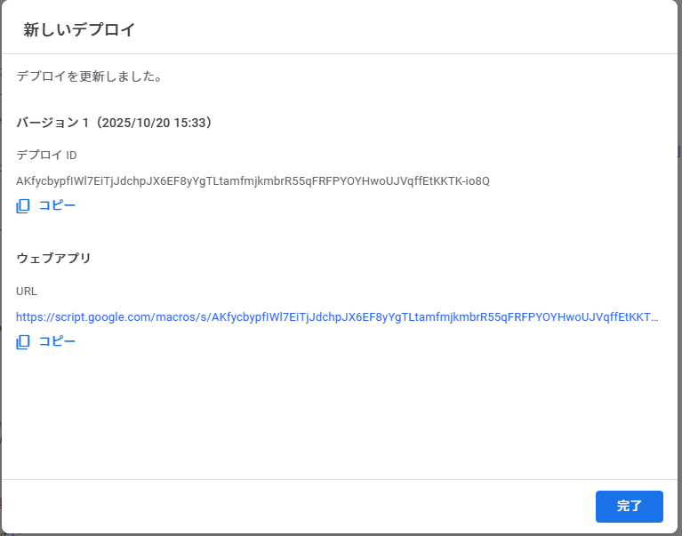

デプロイが完了するはずです。一番下に表示される「URL」が今回のデプロイに紐付けられた世界で1つのURLです。「コピー」ボタンをクリックしてURLをコピーし、メモ帳などに貼り付けておきましょう。

### Chrome拡張側

`chrome://extensions/`から拡張機能の詳細を開き、

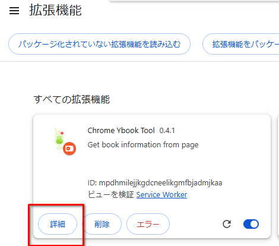

スクロールすると……

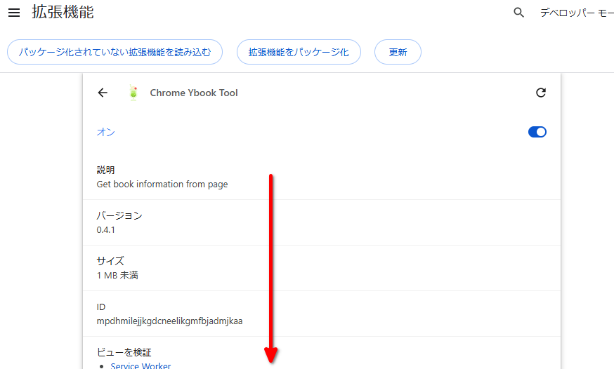

 `拡張機能のオプション` というセクションがあります。クリックしてオプション設定画面を開きましょう（拡張機能のアイコンを右クリックしても同じ画面にアクセスできます）。

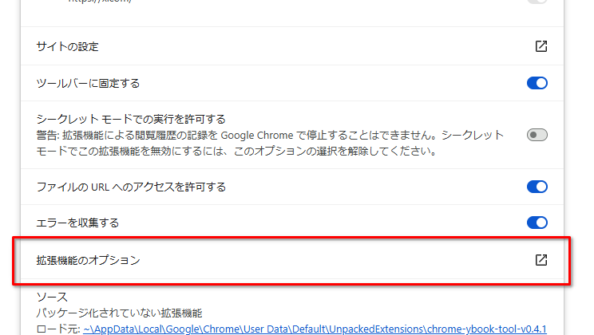


`Google Apps Script deploy URL` の入力ボックスに、先ほどコピーしておいたデプロイURLを貼り付けて `Save` ボタンを押すと初期登録が完了します。

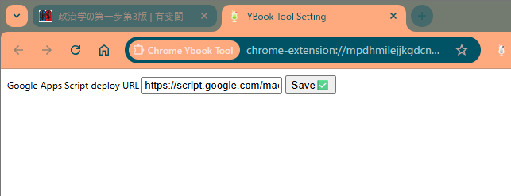


これで、「シートに登録」ボタンを押したときにそのページの情報がシートに登録されるようになります。

#### `Googleスプレッドシートに記録するためのURLが未設定です` と表示されたとき

拡張機能を入れ直したなどで、デプロイURLがリセットされたことによるエラーです。

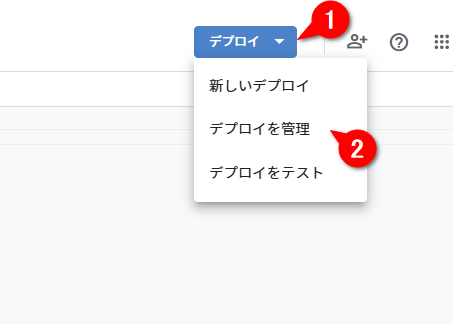

右上の `デプロイ` から `デプロイを管理` をクリックして、

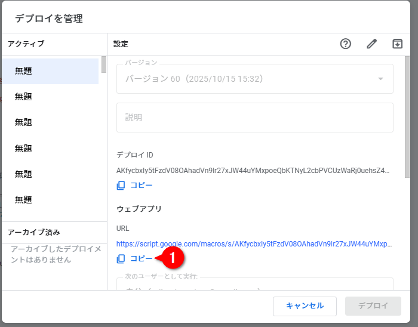

最初に表示されるURLをコピー。あとは上にあるように拡張機能のオプション画面からこのURLを設定します。
